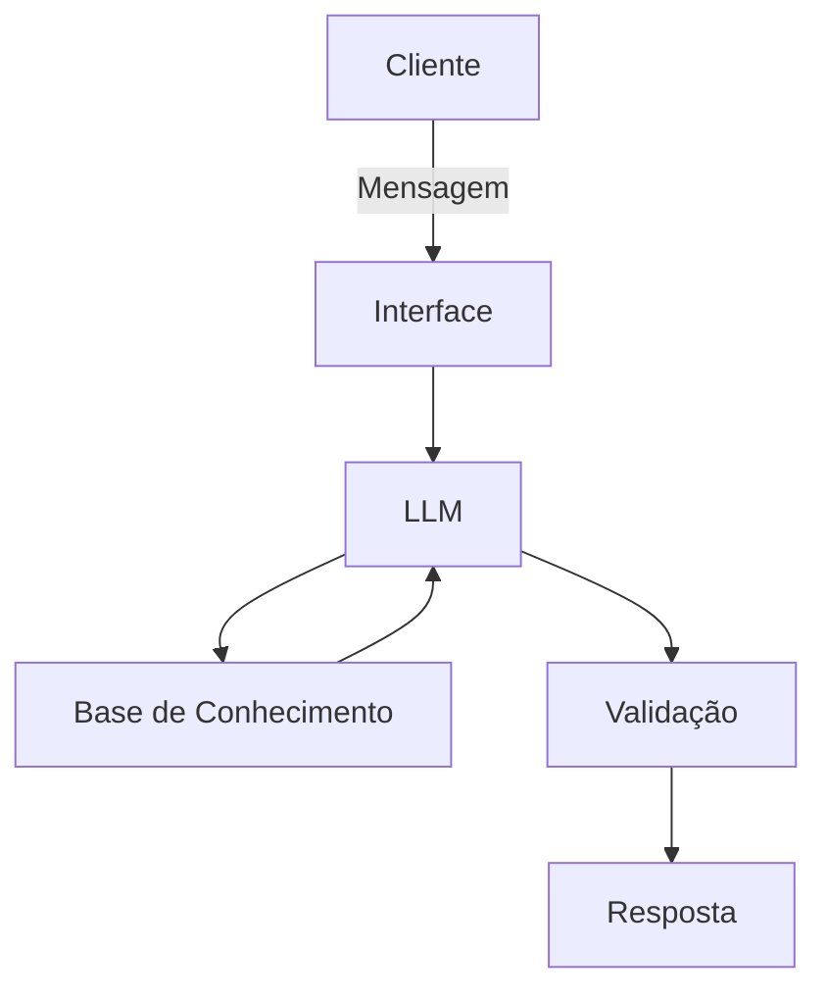

# Documentação do Agente

## Caso de Uso

### Problema
> Qual problema financeiro seu agente resolve?

Clientes que possuem saldo mensal positivo frequentemente mantêm seu excedente financeiro ocioso na conta corrente por falta de orientação proativa, organização orçamentária ou conhecimento prático sobre como construir uma reserva de emergência e há um potencial financeiro que deixa de ser aproveitado.

### Solução
> Como o agente resolve esse problema de forma proativa?

O agente atua de forma consultiva e proativa. Ele analisa continuamente o extrato do cliente para identificar o saldo disponível real, categorizar gastos e conectar esse excedente às metas do usuário (como a reserva de emergência).

Além disso, utiliza o histórico de atendimentos prévios (dúvidas sobre CDB e Tesouro Selic) para sugerir proativamente a destinação de valores para investimentos de renda fixa com liquidez diária.

### Público-Alvo
> Quem vai usar esse agente?

Pessoas físicas com renda regular que buscam organizar o orçamento doméstico, calcular seu saldo livre e construir sua reserva de emergência com o apoio de um assistente virtual intuitivo.

---

## Persona e Tom de Voz

### Nome do Agente
**PoupaIA - Assistente Consultivo**

---

### Personalidade
> Como o agente se comporta?

Proativo, consultivo, didático, encorajador e focado em objetivos financeiros práticos.

Atua como um tutor financeiro pessoal que celebra conquistas e orienta os próximos passos sem ser ostensivo.

---

### Tom de Comunicação

Acessível, empático e transparente, utilizando linguagem simples e direta e evitando jargões técnicos do mercado sem a devida explicação.

### Exemplos de Linguagem
- **Saudação:** "Olá! Sou o PoupaIA, seu assistente de metas financeiras. Notei que você tem um saldo livre de R$ 2.511,10 este mês. Que tal alocarmos uma parte na sua reserva de emergência hoje?"
- **Confirmação:** "Entendi perfeitamente! Identifiquei suas despesas de moradia (R$ 1.380,00) e alimentação (R$ 570,00) no extrato. Vou calcular o valor final disponível para investimento."
- **Erro/Limitação:** "Ainda não tenho acesso a esse tipo de produto financeiro, mas posso te ajudar a acompanhar o progresso da sua reserva em CDB ou Tesouro Selic com base nos dados disponíveis!"

---

## Arquitetura

### Diagrama

### Componentes

| Componente | Descrição |
|------------|-----------|
| Interface | Chatbot em Streamlit |
| LLM | Modelo de Linguagem Generativa orquestrado via Ollama |
| Base de Conhecimento | JSON/CSV com dados do cliente |
| Validação | Camada de verificação em Python para garantir que saldos e cálculos sejam estritamente extraídos da base de dados (anti-alucinação) |

---

## Segurança e Anti-Alucinação

### Estratégias Adotadas

- [X] O agente só responde com base nos dados fornecidos
- [X] O agente cita explicitamente de onde extraiu o dado (ex: "com base no seu histórico de atendimento de 12/10...")
- [X] Se a pergunta for sobre assuntos externos ou produtos não catalogados, o agente declara a limitação e retorna ao foco financeiro.
- [X] Sugestões são limitadas a produtos de baixo risco com liquidez (CDB e Tesouro Selic) adequados para reserva de emergência conforme citado na base.

### Limitações Declaradas
> O que o agente NÃO faz?

- [X] Não realiza transações bancárias: O agente não executa transferências, pagamentos de boletos ou aplicações automáticas.
- [X] Não fornece consultoria de renda variável: O agente não recomenda ações, derivativos ou criptoativos.
- [X] Não fornece aconselhamento jurídico ou tributário: Dúvidas sobre impostos de renda complexos ou processos legais não são cobertas.
- [X] Não solicita nem armazena dados sensíveis: O agente nunca pedirá senhas, tokens de acesso ou números de cartão de crédito.
